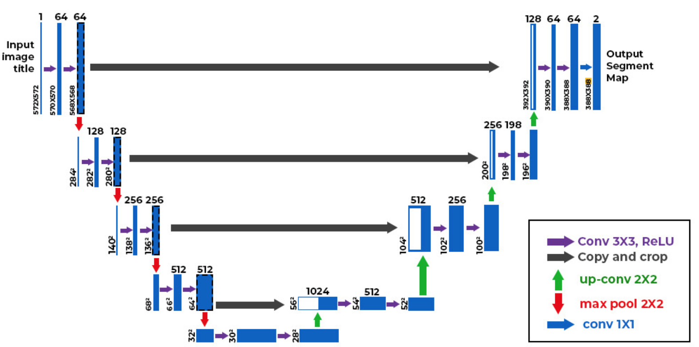
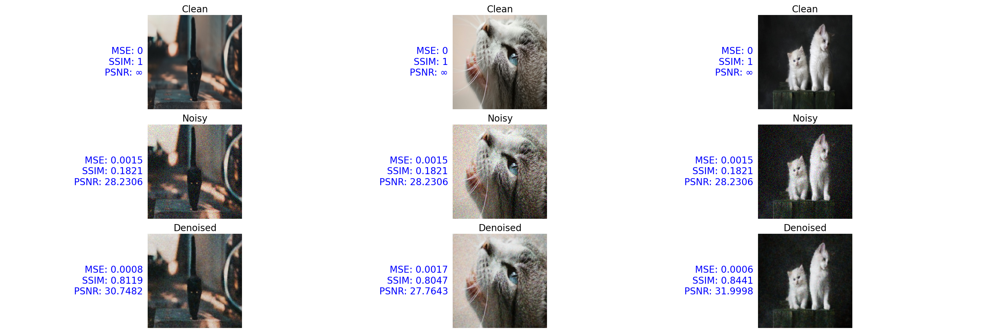
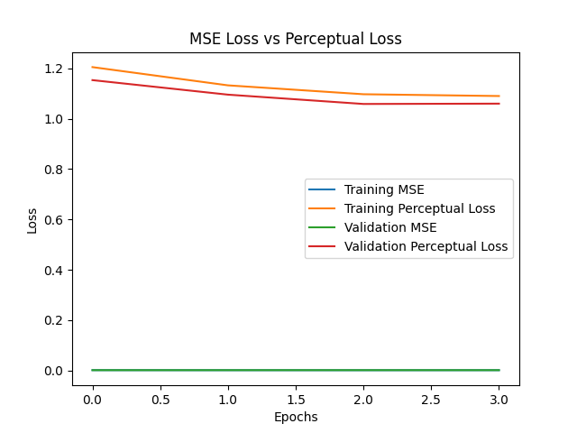
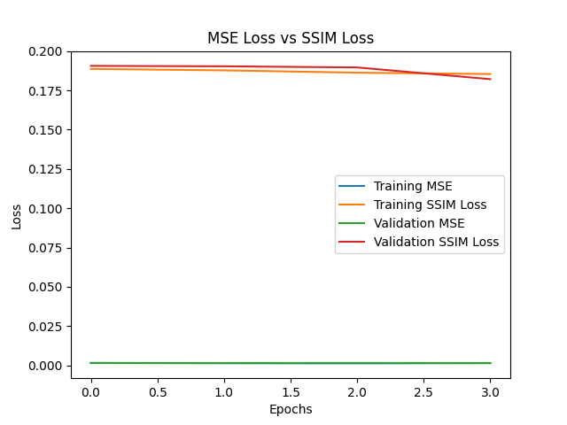

# Image Denoising with U-Net Using Perceptual and SSIM Loss

---

## Overview
This project implements an **image denoising pipeline** using a **U-Net architecture** enhanced with **perceptual loss (VGG19)** and **structural similarity (SSIM)** metrics.  
The goal is to remove Gaussian noise from images while preserving high-level visual features and structural content.

---

## Dataset
- **Source:** `cats-resized256` dataset  
- **Size:** 1035 images, each **256×256×3**  
- **Noisy Data Generation:**  
  - Gaussian noise (`mean=0`, `std=25`) added to clean images.  
  - Pixel values clipped to range `[0, 255]`.  
- **Train/Validation Split:**  
  - Training: 828 images  
  - Validation: 207 images  
- **Normalization:** All images scaled to `[0, 1]`.

---

## Loss Functions
1. **Mean Squared Error (MSE)** – pixel-wise difference between predicted and ground-truth images.  
2. **Structural Similarity (SSIM) Loss** – captures perceptual similarity (1 - SSIM).  
3. **Perceptual Loss (VGG19)** – compares feature maps between predicted and clean images using a pre-trained **VGG19 (block4_conv4)** layer.  

Final loss used in training:  
- Combination of **MSE**, **SSIM loss**, and **perceptual loss**.

---

## Model Architecture: U-Net

- **Encoder (downsampling path):**
  - 4 levels of Conv2D + MaxPooling layers.  
  - Filter progression: 64 → 128 → 256 → 512.  
- **Bottleneck:**  
  - Two Conv2D layers with 1024 filters.  
- **Decoder (upsampling path):**
  - UpSampling + Concatenate with encoder features.  
  - Filter progression: 512 → 256 → 128 → 64.  
- **Output:**  
  - `Conv2D(3, kernel=1, activation='sigmoid')` for RGB reconstruction.  

---

## Training
- **Optimizer:** Adam  
- **Batch Size:** 32  
- **Epochs:** 4  
- **Validation:** noisy → denoised compared with ground-truth clean images.  

### Training Logs (summary)
- **Losses decreased across epochs.**  
- **MSE ≈ 0.0015**  
- **SSIM Loss ≈ 0.18**  
- **Perceptual Loss ≈ 1.05**  

---

## Evaluation Metrics
- **Mean Squared Error (MSE):** pixel-wise accuracy.  
- **SSIM:** measures structural similarity between clean and denoised images.  
- **PSNR:** peak signal-to-noise ratio for quality comparison.  

---

## Results

- **Validation Results:**  
  - MSE: ~0.0015  
  - SSIM: ~0.18  
  - Perceptual Loss: ~1.05  
- **Visualizations:**  
  - Side-by-side comparison of **clean, noisy, and denoised images**.  
  - Metrics (MSE, SSIM, PSNR) displayed on image plots.

| MSE Loss vs. Perceptual Loss               | MSE Loss vs. SSIM Loss            |
|------------------------|------------------------|
|    |    |

- **Training Curves:**  
  - Plots of **MSE vs Perceptual Loss**.  
  - Plots of **MSE vs SSIM Loss**.  

---

## Key Takeaways
- U-Net successfully **denoises images**, recovering structure from noisy inputs.  
- **Perceptual loss helps preserve semantic content** that pixel-based losses may miss.  
- Combining **MSE, SSIM, and perceptual loss** provides a balance between **pixel accuracy and perceptual quality**.  
